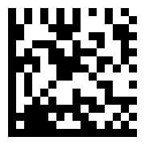

# Data Matrix

[Back to the index](../index.md)

- **Name:** `data-matrix` — also `datamatrix`, `dm`, `ecc200`
- **Accepts:** any byte string, up to 1556 bytes of ASCII or 778 digit pairs
- **Payload:** `ScanMePHP`
- **Modules:** 16 × 16

## Every renderer

## SVG



## PNG


## HTML — div

Not embedded — a markdown page strips the styling an HTML
symbol lives on. Open the standalone file:
[`html-div.html`](../assets/data-matrix/html-div.html)

## HTML — table

Not embedded — a markdown page strips the styling an HTML
symbol lives on. Open the standalone file:
[`html-table.html`](../assets/data-matrix/html-table.html)

## ASCII — blocks

```text
                  
 █ █ █ █ █ █ █ █  
 █ █ █ █ █   █  █ 
 ██   ████    ██  
 ██    ██  ██ ███ 
 █  ███  █  █  █  
 █ █  ██ ███   ██ 
 ████ ████  ██ █  
 ██ █  ████ █ █ █ 
 █ █   ██  █      
 █ █  █     ██  █ 
 █ █ █   █   █    
 █  █ █  ███ ████ 
 █ ███████ ██  █  
 █████ █ ██   █ █ 
 █ ████   ██ █ █  
 ████████████████
```

Also as a file: [`ascii-blocks.txt`](../assets/data-matrix/ascii-blocks.txt)

## ASCII — half blocks

```text
                  
 █ █ █ █ █ ▀ █ ▀▄ 
 ██   ▀██▀ ▄▄ ██▄ 
 █ ▄▀▀█▄ █▄▄▀  █▄ 
 ██▀█ ▀███▄ █▀▄▀▄ 
 █ █  ▄▀▀  ▀▄▄  ▄ 
 █ ▀▄▀▄  █▄▄ █▄▄▄ 
 █▄███▀█▀█▄▀▀ ▄▀▄ 
 █▄████▄▄▄██▄█▄█▄
```

Also as a file: [`ascii-half-blocks.txt`](../assets/data-matrix/ascii-half-blocks.txt)

## ASCII — dots

```text
                  
 ● ● ● ● ● ● ● ●  
 ● ● ● ● ●   ●  ● 
 ●●   ●●●●    ●●  
 ●●    ●●  ●● ●●● 
 ●  ●●●  ●  ●  ●  
 ● ●  ●● ●●●   ●● 
 ●●●● ●●●●  ●● ●  
 ●● ●  ●●●● ● ● ● 
 ● ●   ●●  ●      
 ● ●  ●     ●●  ● 
 ● ● ●   ●   ●    
 ●  ● ●  ●●● ●●●● 
 ● ●●●●●●● ●●  ●  
 ●●●●● ● ●●   ● ● 
 ● ●●●●   ●● ● ●  
 ●●●●●●●●●●●●●●●●
```

Also as a file: [`ascii-dots.txt`](../assets/data-matrix/ascii-dots.txt)
