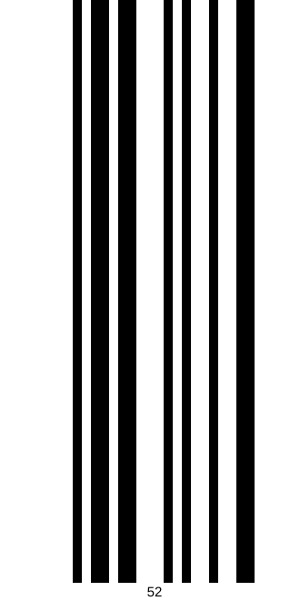
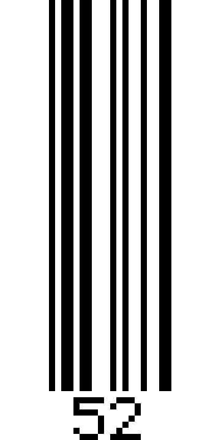

# EAN-2

[Back to the index](../index.md)

- **Name:** `ean2` — also `ean-2`
- **Accepts:** exactly 2 digits, no check digit
- **Payload:** `52`
- **Modules:** 21 × 1

## Every renderer

## SVG



## PNG



## HTML — div

Not embedded — a markdown page strips the styling an HTML
symbol lives on. Open the standalone file:
[`html-div.html`](../assets/ean2/html-div.html)

## HTML — table

Not embedded — a markdown page strips the styling an HTML
symbol lives on. Open the standalone file:
[`html-table.html`](../assets/ean2/html-table.html)

## ASCII — blocks

```text
        █ ██ ██   █ █  █  ██     
        █ ██ ██   █ █  █  ██     
        █ ██ ██   █ █  █  ██     
        █ ██ ██   █ █  █  ██     
        █ ██ ██   █ █  █  ██     
        █ ██ ██   █ █  █  ██     
        █ ██ ██   █ █  █  ██     
        █ ██ ██   █ █  █  ██     
        █ ██ ██   █ █  █  ██     
        █ ██ ██   █ █  █  ██     
        █ ██ ██   █ █  █  ██     
        █ ██ ██   █ █  █  ██     
        █ ██ ██   █ █  █  ██     
        █ ██ ██   █ █  █  ██     
        █ ██ ██   █ █  █  ██     
        █ ██ ██   █ █  █  ██     
        █ ██ ██   █ █  █  ██     
        █ ██ ██   █ █  █  ██     
        █ ██ ██   █ █  █  ██     
        █ ██ ██   █ █  █  ██     
        █ ██ ██   █ █  █  ██     
        █ ██ ██   █ █  █  ██     
        █ ██ ██   █ █  █  ██     
        █ ██ ██   █ █  █  ██     
        █ ██ ██   █ █  █  ██     
        █ ██ ██   █ █  █  ██     
        █ ██ ██   █ █  █  ██     
        █ ██ ██   █ █  █  ██     
        █ ██ ██   █ █  █  ██     
        █ ██ ██   █ █  █  ██     
        █ ██ ██   █ █  █  ██     
        █ ██ ██   █ █  █  ██     
        █ ██ ██   █ █  █  ██     
        █ ██ ██   █ █  █  ██     
        █ ██ ██   █ █  █  ██     
        █ ██ ██   █ █  █  ██     
        █ ██ ██   █ █  █  ██     
        █ ██ ██   █ █  █  ██     
        █ ██ ██   █ █  █  ██     
        █ ██ ██   █ █  █  ██     
        █ ██ ██   █ █  █  ██     
        █ ██ ██   █ █  █  ██     
        █ ██ ██   █ █  █  ██     
        █ ██ ██   █ █  █  ██     
        █ ██ ██   █ █  █  ██     
        █ ██ ██   █ █  █  ██     
        █ ██ ██   █ █  █  ██     
        █ ██ ██   █ █  █  ██     
        █ ██ ██   █ █  █  ██     
        █ ██ ██   █ █  █  ██     
        █ ██ ██   █ █  █  ██     
        █ ██ ██   █ █  █  ██     
        █ ██ ██   █ █  █  ██     
        █ ██ ██   █ █  █  ██     
        █ ██ ██   █ █  █  ██     
        █ ██ ██   █ █  █  ██     
        █ ██ ██   █ █  █  ██     
        █ ██ ██   █ █  █  ██     
        █ ██ ██   █ █  █  ██     
        █ ██ ██   █ █  █  ██     
        █ ██ ██   █ █  █  ██     
        █ ██ ██   █ █  █  ██     
        █ ██ ██   █ █  █  ██     
        █ ██ ██   █ █  █  ██     
                                 
               52
```

Also as a file: [`ascii-blocks.txt`](../assets/ean2/ascii-blocks.txt)

## ASCII — half blocks

```text
        █ ██ ██   █ █  █  ██     
        █ ██ ██   █ █  █  ██     
        █ ██ ██   █ █  █  ██     
        █ ██ ██   █ █  █  ██     
        █ ██ ██   █ █  █  ██     
        █ ██ ██   █ █  █  ██     
        █ ██ ██   █ █  █  ██     
        █ ██ ██   █ █  █  ██     
        █ ██ ██   █ █  █  ██     
        █ ██ ██   █ █  █  ██     
        █ ██ ██   █ █  █  ██     
        █ ██ ██   █ █  █  ██     
        █ ██ ██   █ █  █  ██     
        █ ██ ██   █ █  █  ██     
        █ ██ ██   █ █  █  ██     
        █ ██ ██   █ █  █  ██     
        █ ██ ██   █ █  █  ██     
        █ ██ ██   █ █  █  ██     
        █ ██ ██   █ █  █  ██     
        █ ██ ██   █ █  █  ██     
        █ ██ ██   █ █  █  ██     
        █ ██ ██   █ █  █  ██     
        █ ██ ██   █ █  █  ██     
        █ ██ ██   █ █  █  ██     
        █ ██ ██   █ █  █  ██     
        █ ██ ██   █ █  █  ██     
        █ ██ ██   █ █  █  ██     
        █ ██ ██   █ █  █  ██     
        █ ██ ██   █ █  █  ██     
        █ ██ ██   █ █  █  ██     
        █ ██ ██   █ █  █  ██     
        █ ██ ██   █ █  █  ██     
                                 
               52
```

Also as a file: [`ascii-half-blocks.txt`](../assets/ean2/ascii-half-blocks.txt)

## ASCII — dots

```text
        ● ●● ●●   ● ●  ●  ●●     
        ● ●● ●●   ● ●  ●  ●●     
        ● ●● ●●   ● ●  ●  ●●     
        ● ●● ●●   ● ●  ●  ●●     
        ● ●● ●●   ● ●  ●  ●●     
        ● ●● ●●   ● ●  ●  ●●     
        ● ●● ●●   ● ●  ●  ●●     
        ● ●● ●●   ● ●  ●  ●●     
        ● ●● ●●   ● ●  ●  ●●     
        ● ●● ●●   ● ●  ●  ●●     
        ● ●● ●●   ● ●  ●  ●●     
        ● ●● ●●   ● ●  ●  ●●     
        ● ●● ●●   ● ●  ●  ●●     
        ● ●● ●●   ● ●  ●  ●●     
        ● ●● ●●   ● ●  ●  ●●     
        ● ●● ●●   ● ●  ●  ●●     
        ● ●● ●●   ● ●  ●  ●●     
        ● ●● ●●   ● ●  ●  ●●     
        ● ●● ●●   ● ●  ●  ●●     
        ● ●● ●●   ● ●  ●  ●●     
        ● ●● ●●   ● ●  ●  ●●     
        ● ●● ●●   ● ●  ●  ●●     
        ● ●● ●●   ● ●  ●  ●●     
        ● ●● ●●   ● ●  ●  ●●     
        ● ●● ●●   ● ●  ●  ●●     
        ● ●● ●●   ● ●  ●  ●●     
        ● ●● ●●   ● ●  ●  ●●     
        ● ●● ●●   ● ●  ●  ●●     
        ● ●● ●●   ● ●  ●  ●●     
        ● ●● ●●   ● ●  ●  ●●     
        ● ●● ●●   ● ●  ●  ●●     
        ● ●● ●●   ● ●  ●  ●●     
        ● ●● ●●   ● ●  ●  ●●     
        ● ●● ●●   ● ●  ●  ●●     
        ● ●● ●●   ● ●  ●  ●●     
        ● ●● ●●   ● ●  ●  ●●     
        ● ●● ●●   ● ●  ●  ●●     
        ● ●● ●●   ● ●  ●  ●●     
        ● ●● ●●   ● ●  ●  ●●     
        ● ●● ●●   ● ●  ●  ●●     
        ● ●● ●●   ● ●  ●  ●●     
        ● ●● ●●   ● ●  ●  ●●     
        ● ●● ●●   ● ●  ●  ●●     
        ● ●● ●●   ● ●  ●  ●●     
        ● ●● ●●   ● ●  ●  ●●     
        ● ●● ●●   ● ●  ●  ●●     
        ● ●● ●●   ● ●  ●  ●●     
        ● ●● ●●   ● ●  ●  ●●     
        ● ●● ●●   ● ●  ●  ●●     
        ● ●● ●●   ● ●  ●  ●●     
        ● ●● ●●   ● ●  ●  ●●     
        ● ●● ●●   ● ●  ●  ●●     
        ● ●● ●●   ● ●  ●  ●●     
        ● ●● ●●   ● ●  ●  ●●     
        ● ●● ●●   ● ●  ●  ●●     
        ● ●● ●●   ● ●  ●  ●●     
        ● ●● ●●   ● ●  ●  ●●     
        ● ●● ●●   ● ●  ●  ●●     
        ● ●● ●●   ● ●  ●  ●●     
        ● ●● ●●   ● ●  ●  ●●     
        ● ●● ●●   ● ●  ●  ●●     
        ● ●● ●●   ● ●  ●  ●●     
        ● ●● ●●   ● ●  ●  ●●     
        ● ●● ●●   ● ●  ●  ●●     
                                 
               52
```

Also as a file: [`ascii-dots.txt`](../assets/ean2/ascii-dots.txt)
