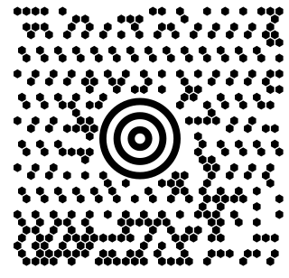
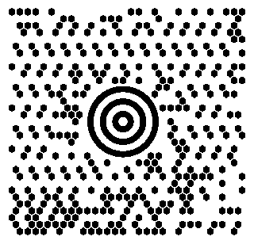

# MaxiCode

[Back to the index](../index.md)

- **Name:** `maxicode` — also `maxi-code`, `ups-code`
- **Accepts:** any byte string, up to 93 codewords — about 93 characters of upper case text or 138 digits, and 84 codewords in the two structured modes
- **Payload:** `SHIP TO 123 MAIN ST`
- **Modules:** 30 × 33

## Every renderer

## SVG

## PNG

## HTML — div

> Not drawn: The "html-div" renderer cannot render this maxicode symbol: it cannot draw hexagon modules (it draws: square); part of the symbology's finder is not in the module grid and has to be drawn by the renderer — concentric rings are not modules — and this renderer draws only what the grid holds

## HTML — table

> Not drawn: The "html-table" renderer cannot render this maxicode symbol: it cannot draw hexagon modules (it draws: square); part of the symbology's finder is not in the module grid and has to be drawn by the renderer — concentric rings are not modules — and this renderer draws only what the grid holds

## ASCII — blocks

> Not drawn: The "ascii-blocks" renderer cannot render this maxicode symbol: it cannot draw hexagon modules (it draws: square); part of the symbology's finder is not in the module grid and has to be drawn by the renderer — concentric rings are not modules — and this renderer draws only what the grid holds

## ASCII — half blocks

> Not drawn: The "ascii-half-blocks" renderer cannot render this maxicode symbol: it cannot draw hexagon modules (it draws: square); part of the symbology's finder is not in the module grid and has to be drawn by the renderer — concentric rings are not modules — and this renderer draws only what the grid holds

## ASCII — dots

> Not drawn: The "ascii-dots" renderer cannot render this maxicode symbol: it cannot draw hexagon modules (it draws: square); part of the symbology's finder is not in the module grid and has to be drawn by the renderer — concentric rings are not modules — and this renderer draws only what the grid holds
