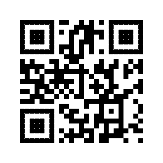

# QR Code

[Back to the index](../index.md)

- **Name:** `qrcode` — also `qr`
- **Accepts:** any byte string, up to 2953 bytes at error correction level L
- **Payload:** `https://scanmephp.dev`
- **Modules:** 25 × 25
- **Error correction:** L, M, Q, H

## Every renderer

## SVG



## PNG


## HTML — div

Not embedded — a markdown page strips the styling an HTML
symbol lives on. Open the standalone file:
[`html-div.html`](../assets/qrcode/html-div.html)

## HTML — table

Not embedded — a markdown page strips the styling an HTML
symbol lives on. Open the standalone file:
[`html-table.html`](../assets/qrcode/html-table.html)

## ASCII — blocks

```text
                                 
                                 
                                 
                                 
    ███████ ██  █ █ █ ███████    
    █     █    ████   █     █    
    █ ███ █ █ ██ ████ █ ███ █    
    █ ███ █   █  ██ █ █ ███ █    
    █ ███ █   █ ███   █ ███ █    
    █     █ ███ █ █   █     █    
    ███████ █ █ █ █ █ ███████    
             ████                
    █ █   ██  ██    █  █  █ █    
    █████  █ █  █  ██ ██ █ ██    
    ██ █ █████████ ████  ██ █    
     █  █  ██   █ █  ██  █       
    █████ █████ █  █  █     █    
       ███ █ █  █ ███ ██   ██    
    ██ █ ██ █ █ █  █ ██  ██ █    
      ███  █ █ ██   ██ ███       
    ███ ███      ████████  █     
            ██   █  █   █   █    
    ███████ █ ██    █ █ █   █    
    █     █  ██  █ ██   █  █     
    █ ███ █   ████ ██████   █    
    █ ███ █     █  █ █  █ ██     
    █ ███ █ █ █ ███  █ ███ ██    
    █     █  ████ █ █████        
    ███████ █ █  ██ ██   █  █
```

Also as a file: [`ascii-blocks.txt`](../assets/qrcode/ascii-blocks.txt)

## ASCII — half blocks

```text
                                 
                                 
    █▀▀▀▀▀█ ▀▀ ▄█▄█ ▀ █▀▀▀▀▀█    
    █ ███ █ ▀ █▀ ██▀█ █ ███ █    
    █ ▀▀▀ █ ▄▄█ █▀█   █ ▀▀▀ █    
    ▀▀▀▀▀▀▀ ▀▄█▄█ ▀ ▀ ▀▀▀▀▀▀▀    
    █▄█▄▄ ▀█ ▄▀▀▄  ▄█ ▄█ ▄▀▄█    
    ▀█ ▀▄▀▀██▀▀▀█▀▄▀▀██  █▀ ▀    
    ▀▀▀██▄▀█▀█▀ █ ▄█▄ █▄   ▄█    
    ▀▀▄█▄▀▀▄▀▄▀▄█  ▀▄█▀▄▄█▀ ▀    
    ▀▀▀ ▀▀▀ ▄▄   █▀▀█▀▀▀█  ▀▄    
    █▀▀▀▀▀█ ▀▄█▀ ▄ ▄█ ▀ █  ▄▀    
    █ ███ █   ▀▀█▀ █▀█▀▀█ ▄▄▀    
    █ ▀▀▀ █ ▀▄█▄█▀█ ▄█▄██▀ ▀▀    
    ▀▀▀▀▀▀▀ ▀ ▀  ▀▀ ▀▀   ▀  ▀
```

Also as a file: [`ascii-half-blocks.txt`](../assets/qrcode/ascii-half-blocks.txt)

## ASCII — dots

```text
                                 
                                 
                                 
                                 
    ●●●●●●● ●●  ● ● ● ●●●●●●●    
    ●     ●    ●●●●   ●     ●    
    ● ●●● ● ● ●● ●●●● ● ●●● ●    
    ● ●●● ●   ●  ●● ● ● ●●● ●    
    ● ●●● ●   ● ●●●   ● ●●● ●    
    ●     ● ●●● ● ●   ●     ●    
    ●●●●●●● ● ● ● ● ● ●●●●●●●    
             ●●●●                
    ● ●   ●●  ●●    ●  ●  ● ●    
    ●●●●●  ● ●  ●  ●● ●● ● ●●    
    ●● ● ●●●●●●●●● ●●●●  ●● ●    
     ●  ●  ●●   ● ●  ●●  ●       
    ●●●●● ●●●●● ●  ●  ●     ●    
       ●●● ● ●  ● ●●● ●●   ●●    
    ●● ● ●● ● ● ●  ● ●●  ●● ●    
      ●●●  ● ● ●●   ●● ●●●       
    ●●● ●●●      ●●●●●●●●  ●     
            ●●   ●  ●   ●   ●    
    ●●●●●●● ● ●●    ● ● ●   ●    
    ●     ●  ●●  ● ●●   ●  ●     
    ● ●●● ●   ●●●● ●●●●●●   ●    
    ● ●●● ●     ●  ● ●  ● ●●     
    ● ●●● ● ● ● ●●●  ● ●●● ●●    
    ●     ●  ●●●● ● ●●●●●        
    ●●●●●●● ● ●  ●● ●●   ●  ●
```

Also as a file: [`ascii-dots.txt`](../assets/qrcode/ascii-dots.txt)
